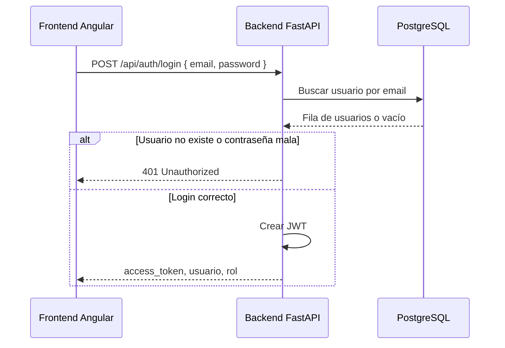

# Guía del Backend — Sistema Sakura (versión fácil)

Este documento explica **cómo funciona el backend** del proyecto de reclutamiento, sin asumir que ya conoces FastAPI o bases de datos.

---

## ¿Qué es el backend?

Es el **servidor** que recibe peticiones del frontend (Angular) y responde con datos o errores.

En este proyecto el backend hace principalmente dos cosas:

1. **Comprobar** que la base de datos PostgreSQL está disponible.
2. **Validar el login** (email + contraseña) y devolver un **token JWT** si todo es correcto.

El frontend **no** habla directo con PostgreSQL. Siempre pasa por el backend.

```
[Navegador / Angular]  ----HTTP---->  [Backend FastAPI]  ----SQL---->  [PostgreSQL]
     :4200                                  :8000                        :5432
```

---

## Tecnologías que usa

| Herramienta | Para qué sirve |
|-------------|----------------|
| **Python** | Lenguaje del servidor |
| **FastAPI** | Crear la API (rutas como `/api/auth/login`) |
| **SQLAlchemy** | Conectar y consultar PostgreSQL desde Python |
| **Pydantic** | Validar que el JSON del login tenga formato correcto |
| **PyJWT** | Crear el token de sesión después del login |
| **Passlib / Bcrypt** | Verificar contraseñas (también admite texto plano en pruebas) |
| **Uvicorn** | Servidor que ejecuta la aplicación |
| **PostgreSQL** | Donde están guardados los usuarios |

Dependencias listadas en `requirements.txt`.

---

## Estructura de carpetas

```text
Backend/
├── app/
│   ├── main.py       → Punto de entrada: rutas (endpoints) y CORS
│   ├── database.py   → Conexión a PostgreSQL
│   ├── models.py     → Representación de la tabla "usuarios"
│   ├── schemas.py    → Formato de datos que entran y salen por la API
│   └── security.py   → Contraseñas y tokens JWT
├── requirements.txt  → Librerías de Python
├── Dockerfile        → Para correr el backend en Docker
└── GUIA-BACKEND.md   → Este archivo
```

Cada archivo tiene **una responsabilidad**. Así es más fácil de mantener.

---

## Archivo por archivo

### `database.py` — La conexión a la base de datos

Define **cómo** el backend se conecta a PostgreSQL.

- Lee la variable de entorno `DATABASE_URL` si existe (caso **Docker**).
- Si no existe, usa por defecto `127.0.0.1:5432` (caso **local** en tu PC).

La función `obtener_db()` abre una “sesión” con la base de datos para cada petición y la cierra al terminar. FastAPI la usa automáticamente en los endpoints.

---

### `models.py` — La tabla `usuarios` en código

Describe la tabla `usuarios` de PostgreSQL como una clase `Usuario`:

| Campo en BD | Significado |
|-------------|-------------|
| `id` | Número único del usuario |
| `usuario` | Nombre de usuario (ej: `nmchavezm`) |
| `contrasena` | Contraseña guardada en la BD |
| `email` | Correo (se usa para buscar al hacer login) |
| `rol` | Tipo de usuario: `ADMIN`, `RECLUTADORA`, `CANDIDATO`, etc. |

SQLAlchemy traduce entre filas de la tabla y objetos Python.

---

### `schemas.py` — Contrato con el frontend

Define **qué JSON** se espera y **qué JSON** se devuelve.

**Entrada (`LoginRequest`):**

```json
{
  "email": "noelid@gmail.com",
  "password": "noe123"
}
```

**Salida exitosa (`TokenResponse`):**

```json
{
  "access_token": "eyJhbGciOiJIUzI1NiIs...",
  "token_type": "bearer",
  "usuario": "nmchavezm",
  "rol": "CANDIDATO"
}
```

Si el email no es válido, Pydantic rechaza la petición antes de ir a la base de datos.

---

### `security.py` — Seguridad

Dos tareas:

1. **`verificar_password`**: compara la contraseña que envió el usuario con la de la BD.
   - Si coinciden en texto plano → acepta (útil en datos de prueba).
   - Si no, intenta verificar con **bcrypt** (contraseña encriptada).

2. **`crear_token_acceso`**: genera un **JWT** (token) que expira en **60 minutos** e incluye email, rol y nombre de usuario.

La clave secreta del token está en `SECRET_KEY` (en producción debería ir en variables de entorno, no en el código).

---

### `main.py` — El corazón de la API

Aquí se crea la app FastAPI y se definen las **rutas**.

#### CORS

Permite que el frontend en `http://localhost:4200` llame al backend sin que el navegador bloquee la petición.

#### Endpoint 1: `GET /` — Prueba de conexión

- **Qué hace:** ejecuta `SELECT 1` en PostgreSQL.
- **Para qué sirve:** comprobar rápido que backend y base de datos funcionan.
- **Ejemplo:** abrir en el navegador `http://localhost:8000`

#### Endpoint 2: `POST /api/auth/login` — Login

Flujo paso a paso:

```text
1. El frontend envía email y password (JSON)
2. El backend busca un usuario con ese email en la tabla usuarios
3. Si no existe → error 401 "Correo o contraseña incorrectos"
4. Si existe → compara la contraseña
5. Si la contraseña no coincide → error 401
6. Si todo bien → crea un JWT y lo devuelve con usuario y rol
```

Documentación interactiva (Swagger): **http://localhost:8000/docs**

---

## Flujo completo del login (resumen visual)



---

## Cómo se relaciona con la base de datos

Los usuarios de prueba vienen del archivo **`base_inicial.sql`** en la raíz del proyecto. Docker lo carga la **primera vez** que se crea el contenedor de PostgreSQL.

El backend **no lee** ese archivo `.sql`. Solo consulta la tabla `usuarios` que ya quedó creada en PostgreSQL.

Conexión configurada en:

- **Docker:** `docker-compose.yml` → variable `DATABASE_URL` con host `postgres_db`
- **Código:** `app/database.py` → usa esa URL o la de localhost

---

## Cómo ejecutar el backend

### Con Docker (recomendado en equipo)

Desde la raíz del proyecto:

```bash
docker compose up --build
```

API disponible en: `http://localhost:8000`

### En local (sin Docker para el backend)

```bash
cd Backend
.\venv\Scripts\Activate.ps1
pip install -r requirements.txt
uvicorn app.main:app --reload --port 8000
```

Necesitas PostgreSQL corriendo (por ejemplo con `docker compose up postgres_db -d`).

---

## Usuarios de prueba (ejemplos)

| Email | Contraseña | Rol |
|-------|------------|-----|
| `noelid@gmail.com` | `noe123` | CANDIDATO |
| `felipe@gmail.com` | `felipe123` | ADMIN |
| `cathy@gmail.com` | `cathy123` | RECLUTADORA |

Para probar el login desde la documentación: **http://localhost:8000/docs** → `POST /api/auth/login` → *Try it out*.

---

## Preguntas frecuentes

**¿Dónde se guarda la sesión del usuario?**  
En el **token JWT** que devuelve el login. El frontend debe guardarlo (por ejemplo en memoria o `localStorage`) y enviarlo en peticiones futuras cuando se implementen rutas protegidas.

**¿Por qué error 401?**  
Email no existe en la BD, o la contraseña no coincide con el campo `contrasena`.

**¿Puedo agregar más usuarios?**  
Sí, con `INSERT` en PostgreSQL o editando `base_inicial.sql` y recreando el volumen de Docker. Ver conversación / documentación del equipo sobre `usuarios`.

**¿Qué falta por hacer en el backend?**  
Hoy solo hay login y prueba de BD. Más adelante se pueden añadir endpoints protegidos que **validen el JWT** en cada petición (middleware o dependencia de FastAPI).

---

## Glosario rápido

| Término | Significado simple |
|---------|-------------------|
| **API** | Conjunto de URLs que el servidor expone |
| **Endpoint** | Una URL concreta, ej: `/api/auth/login` |
| **JWT** | “Pase” firmado que demuestra que el usuario inició sesión |
| **ORM (SQLAlchemy)** | Escribir consultas en Python en lugar de SQL a mano |
| **CORS** | Reglas del navegador para permitir llamadas entre puertos distintos |
| **Session (BD)** | Conexión temporal para leer/escribir en PostgreSQL |

---

## Resumen en una frase

El backend es un **servidor Python (FastAPI)** que **valida email y contraseña** contra PostgreSQL y, si son correctos, devuelve un **token JWT** para que el frontend sepa quién inició sesión y con qué rol.
